Hello World, 
I Created this repo just to give practical demonstration on some very fundamental concepts of Kafka.

Kafka's insane high throughput, remarkable low latency, and robust scalability 
been the top selling point of why we use it in real time data streaming services.

It's no ordinary messaging system unlike it's rivals,
It's ability to manage distributed data efficiently and reliably, 
combined with features like fault tolerance and zero downtime makes it ideal for 
building systems that deals with millions or billions of messages per second.

Kafka's overwhelming architecture been a nightmare for me and i had to struggle a lot 
to understand this beast. so i created this repo, 
to make it easily understandable with easy to follow hands on activities. Enjoy!!

## _**To follow this lesson make sure you follow this steps**_

1) Make Sure you have Docker Desktop & JDK 21 Installed on your machine.
2) Get the docker compose file from this repo (I have shared) & set up a multi broker cluster in yr machine.
   Run the command "docker compose up -d" in the same dir as this docker compose file, 
   After every images are pulled & we set up containers and they are running, It will look like this

   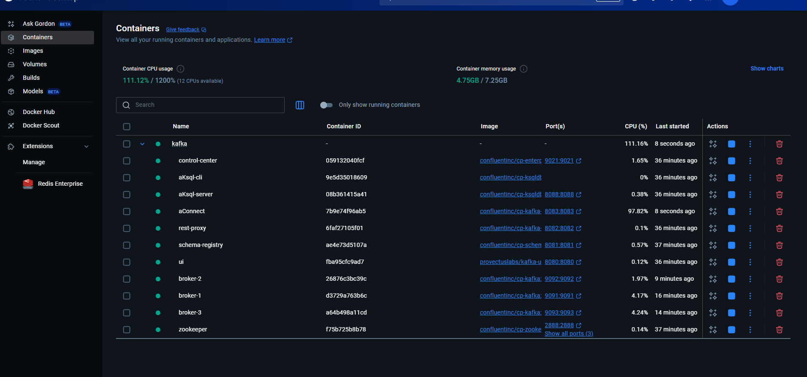

3) Clone my repo & do a simple maven import
   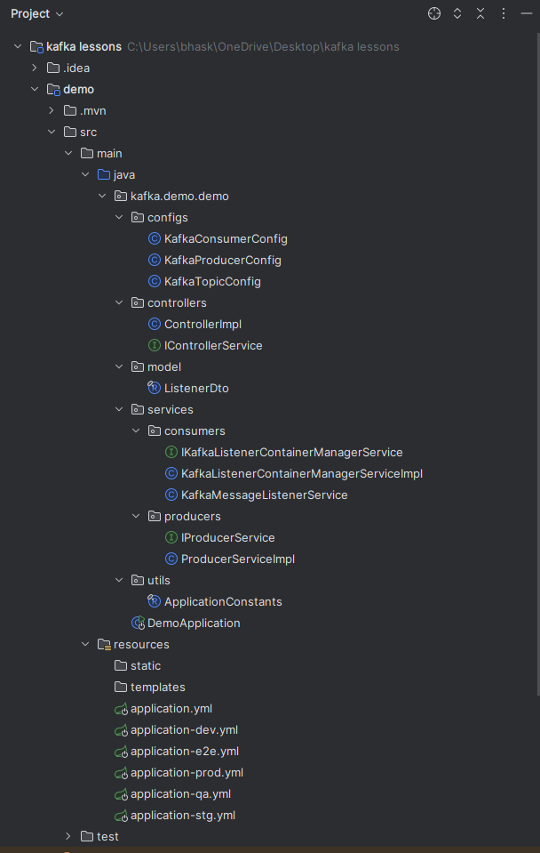

You are now good to follow along!!!

# **Question was we have 3 replicas with min_in_sync_replicas=2 & ack=all right?**

so let's configure them one by one

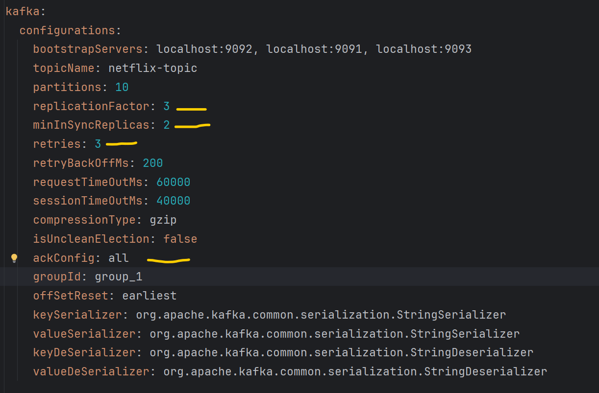

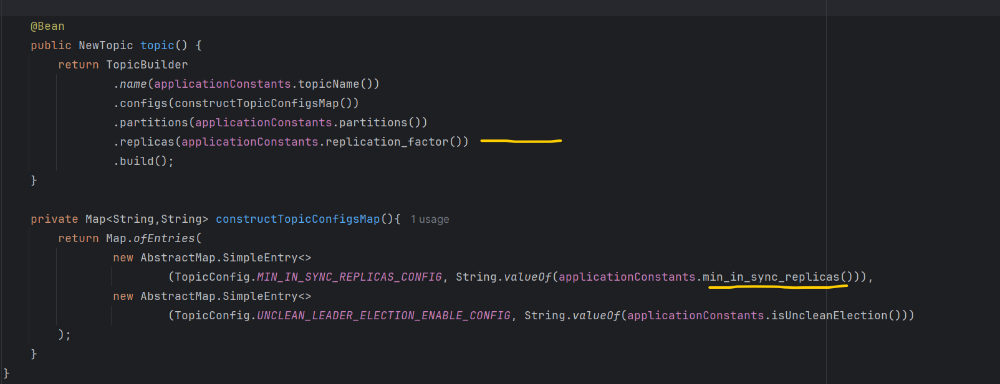

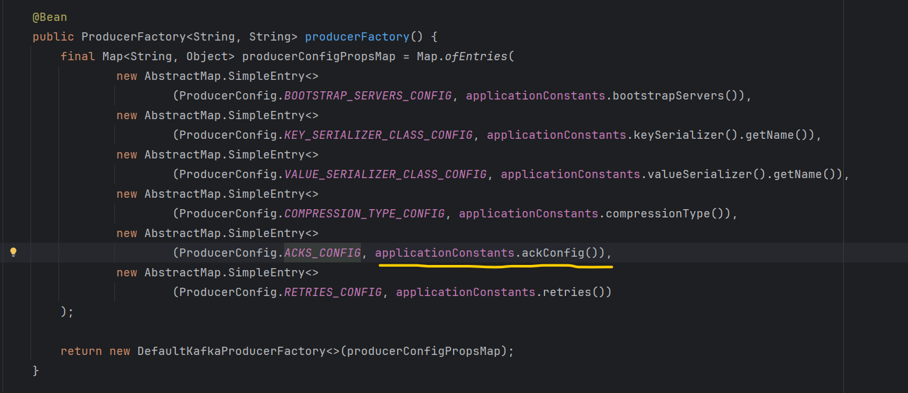

**This is Kafka UI, very helpful for monitoring the cluster**

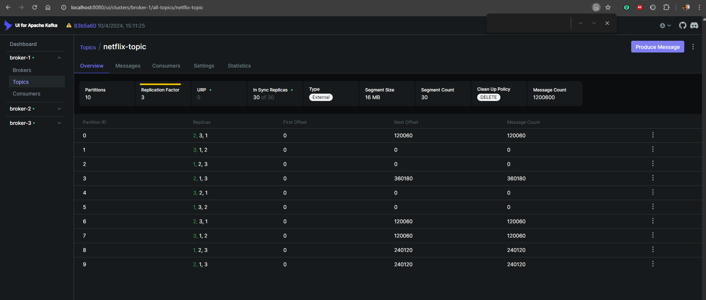

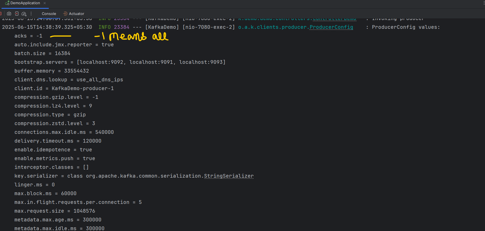

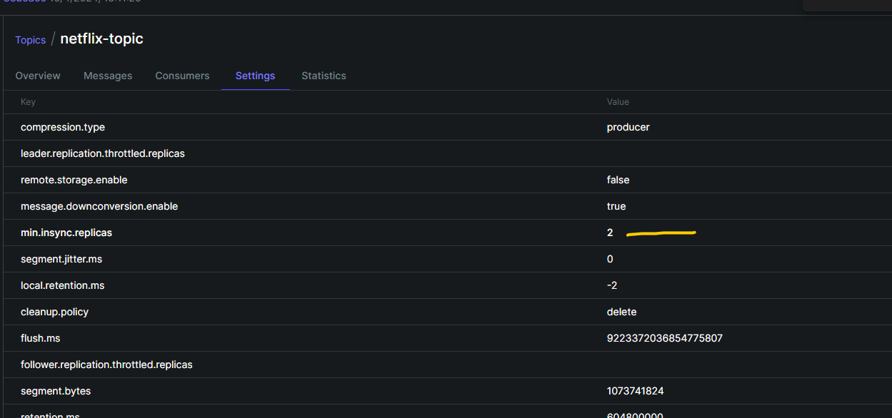

Do not forget to set retries to 3 or some lower numbers, else it will keep on retrying for 2147483647 
until delivery.timeout.ms expires, and it gives TimeoutException.

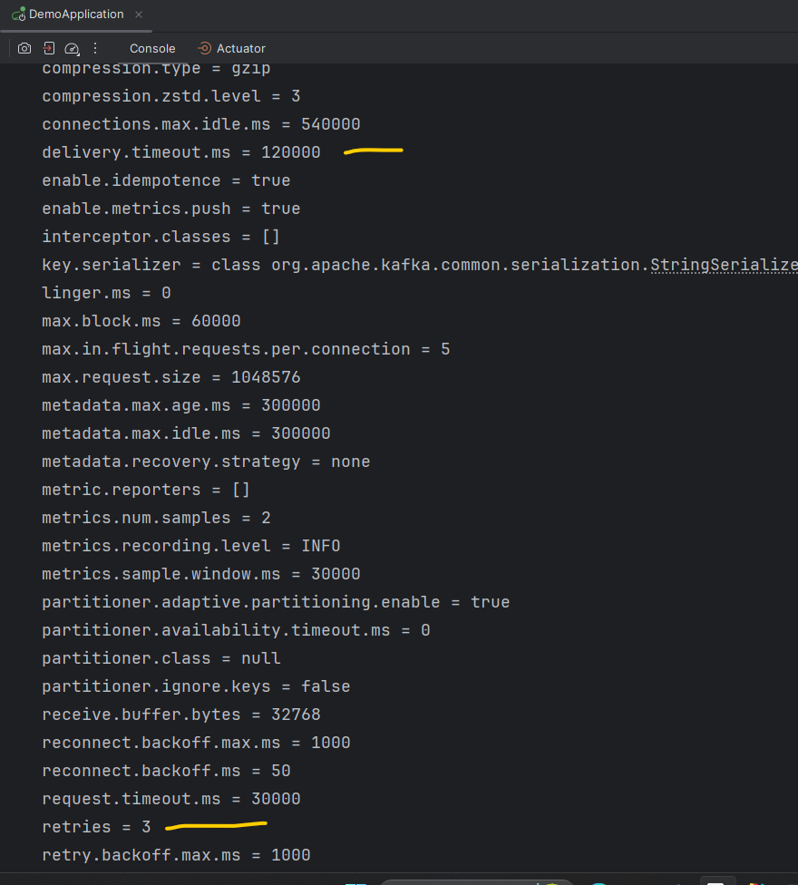

Let's come to the coding part, In controller we have only two apis for simplicity(for this demo only)

1) for producing messages to topic - upon invocation, it produces 100 messages to topic. 

2) for polling messages from topic - upon invocation, it creates a listener which keeps polling in every 4 seconds

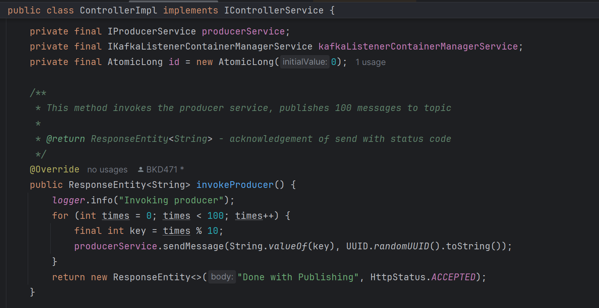

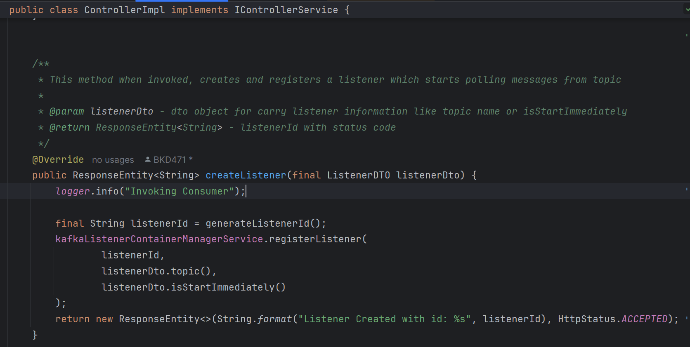

# **Scenario 1: We have all 3 brokers/replicas are live, min_insync=2, ack=all & lets produce & consume**

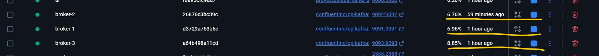

lets produce
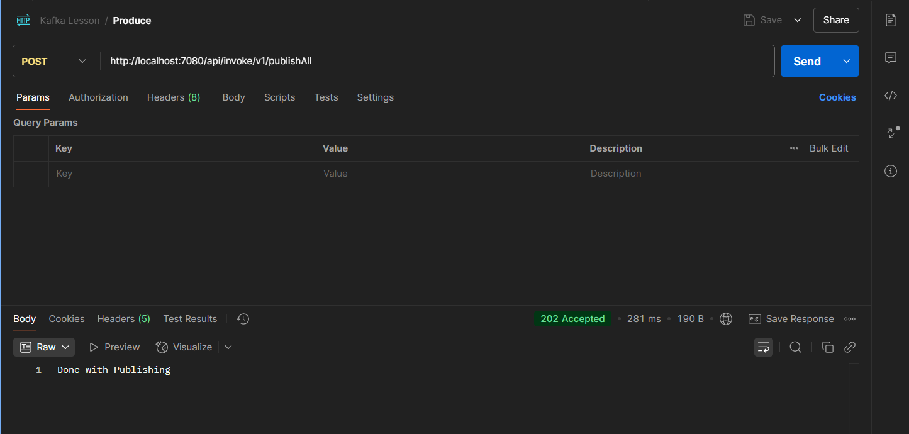

messages got published
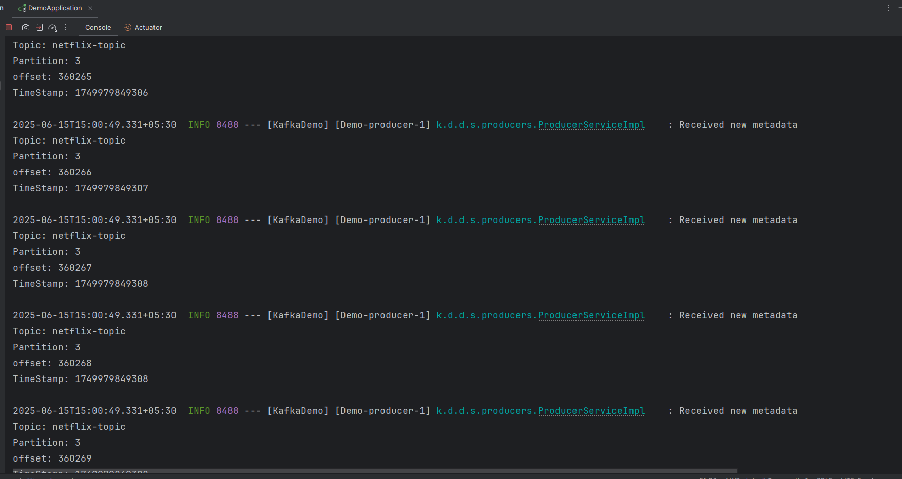

let's start the consumer
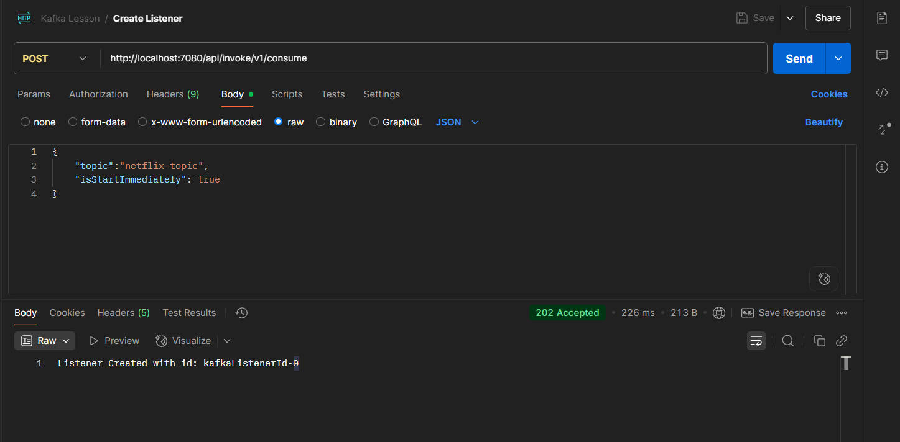

messages are being polled
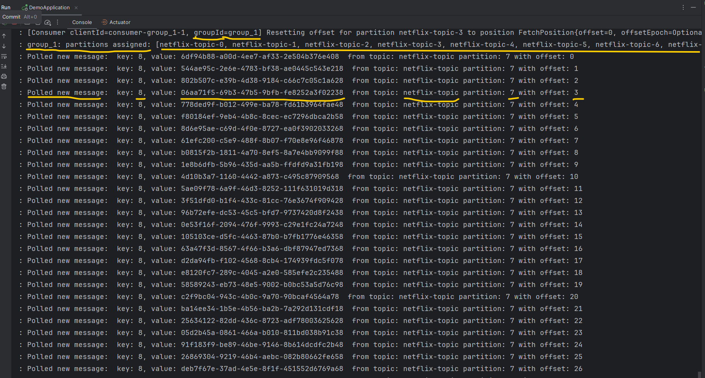

# **Conclusion 1: Both Producers & Consumers are working smoothly.**

# **Scenario 2: We stopped/downed  2 brokers/replicas, min_in_sync=2, ack=all & lets produce & consume**

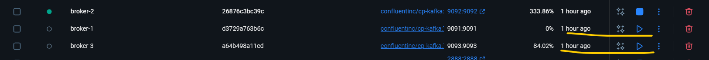

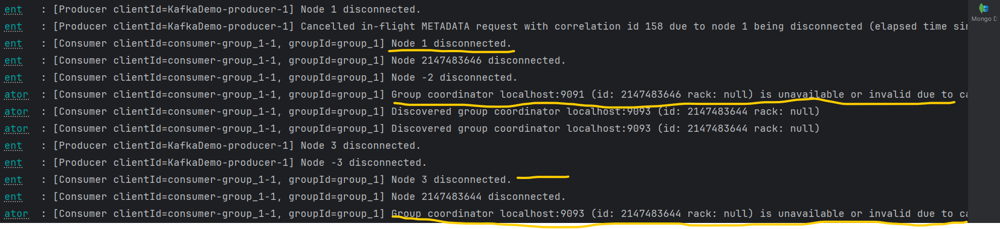

triggered the publisher api from postman and got NotEnoughReplicasException 
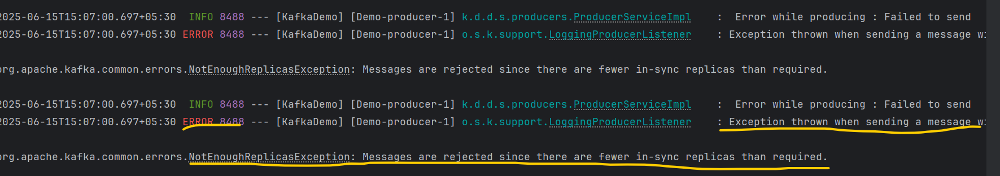

but that already ran consumer is still polling smoothly
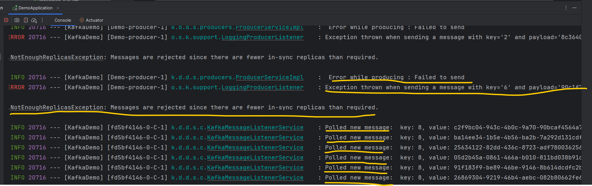

# **Conclusion 2 : Producers throws NotEnoughReplicasException but Consumer is working smoothly.**

